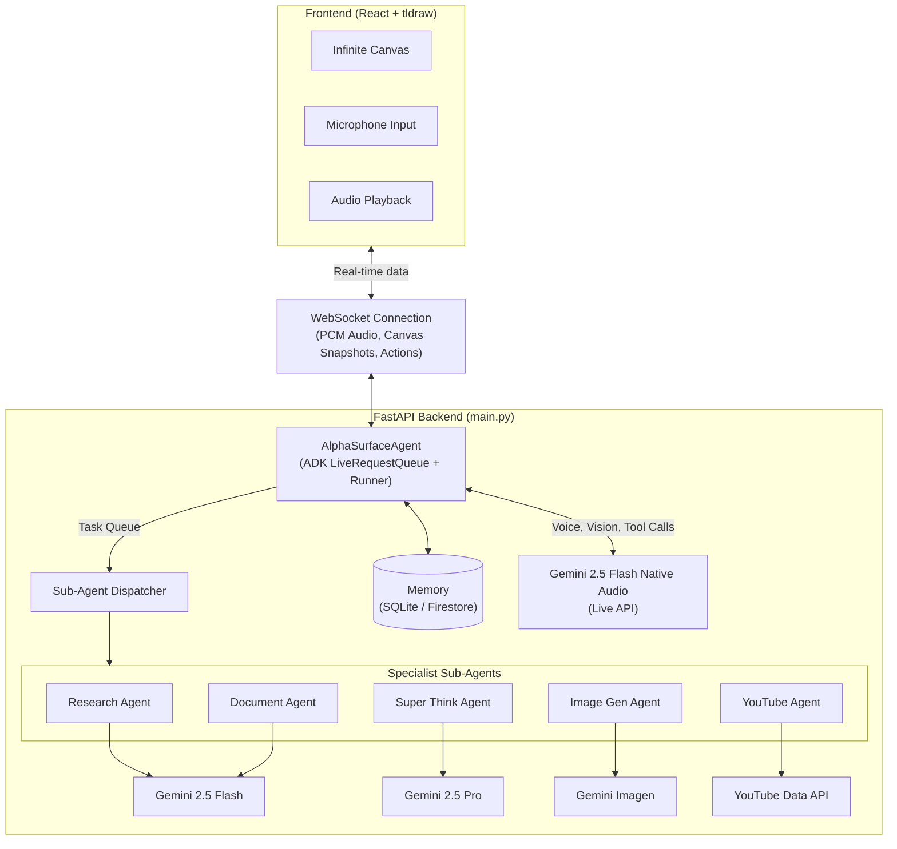

# AlphaSurface Architecture & Deployment Guide

This document answers the questions regarding the technologies used, system architecture, and the fastest way to deploy AlphaSurface to production.

## 1. Technologies Used

AlphaSurface is built using the following stack:

**Frontend:**
- **Language/Framework:** React 19, JavaScript/JSX
- **Build Tool:** Vite
- **Canvas Library:** tldraw v4 (for the infinite canvas and drawing capabilities)
- **Animation:** Framer Motion
- **Icons:** Lucide React
- **PDF Export:** jsPDF

**Backend:**
- **Language:** Python 3.12+
- **Framework:** FastAPI
- **WebSockets:** The `websockets` library (for real-time, bi-directional communication)
- **Package Manager:** uv (astral)
- **Document Processing:** PyMuPDF (PDFs), python-docx (Word documents)
- **Image Processing:** Pillow

**AI & Agents:**
- **Core Orchestration:** Google Agent Development Kit (ADK)
- **Live Voice/Vision Model:** Gemini 2.5 Flash Native Audio (`gemini-2.5-flash-native-audio-preview-12-2025`)
- **Sub-agent Model:** Gemini 2.5 Flash
- **Deep Analysis Model:** Gemini 2.5 Pro
- **Image Generation:** Gemini Imagen / Pollinations (fallback)

**Database / Storage:**
- **Local Development:** SQLite
- **Cloud/Production:** Google Cloud Firestore

**Cloud Platform (Deployment):**
- **Hosting:** Google Cloud Run (Backend), Vercel / Firebase Hosting (Frontend)

---

## 2. System Architecture

The following Mermaid diagram illustrates how the Gemini models connect to the backend, database, and the React frontend.



---

## 3. Fastest Cloud Run Deployment Plan

This is the fastest, easiest way to get AlphaSurface running in production. We will use Google Cloud Run for the backend and Vercel for the frontend.

### Prerequisites (Do this first)
1. Install the [Google Cloud CLI (`gcloud`)](https://cloud.google.com/sdk/docs/install) and run `gcloud auth login`.
2. Create a Google Cloud Project with billing enabled.
3. Install the [Vercel CLI](https://vercel.com/docs/cli) (`npm i -g vercel`) and run `vercel login`.

### Step 1: Deploy the Backend to Google Cloud Run
A `Dockerfile` has been added to the `backend/` directory for immediate use. Cloud Run will automatically build and deploy the container.

1. **Navigate to the backend directory:**
   ```bash
   cd backend
   ```

2. **Run the deployment command:**
   Replace `YOUR_PROJECT_ID` with your actual GCP project ID and `YOUR_GEMINI_API_KEY` with your API key.
   ```bash
   gcloud run deploy alphasurface-backend \
     --source . \
     --project YOUR_PROJECT_ID \
     --region us-central1 \
     --allow-unauthenticated \
     --set-env-vars GEMINI_API_KEY="YOUR_GEMINI_API_KEY",MEMORY_BACKEND="firestore",GOOGLE_CLOUD_PROJECT="YOUR_PROJECT_ID" \
     --memory 1Gi \
     --port 8000
   ```
   *Note: Using `--source .` tells Cloud Run to automatically build the container using the provided `Dockerfile` via Google Cloud Build.*

3. **Save the Backend URL:**
   Once deployment finishes, the terminal will output a Service URL (e.g., `https://alphasurface-backend-xxxxxx-uc.a.run.app`). Copy this URL.

### Step 2: Configure and Deploy the Frontend to Vercel
Vercel is the fastest way to host a Vite React app.

1. **Navigate to the frontend directory:**
   ```bash
   cd ../frontend
   ```

2. **Update the API URL:**
   Open `frontend/vite.config.js`. You need to change the proxy target to point to your new Cloud Run URL.
   ```javascript
   // Change this line:
   // target: 'http://localhost:8000',

   // To this (replace with your actual Cloud Run URL):
   target: 'https://alphasurface-backend-xxxxxx-uc.a.run.app',
   changeOrigin: true, // Add this line!
   ```

3. **Deploy with Vercel:**
   ```bash
   vercel --prod
   ```
   Follow the prompts (accepting the defaults is fine). Vercel will build the frontend and provide you with a live URL.

**Done!** Your app is now live in less than 10 minutes.