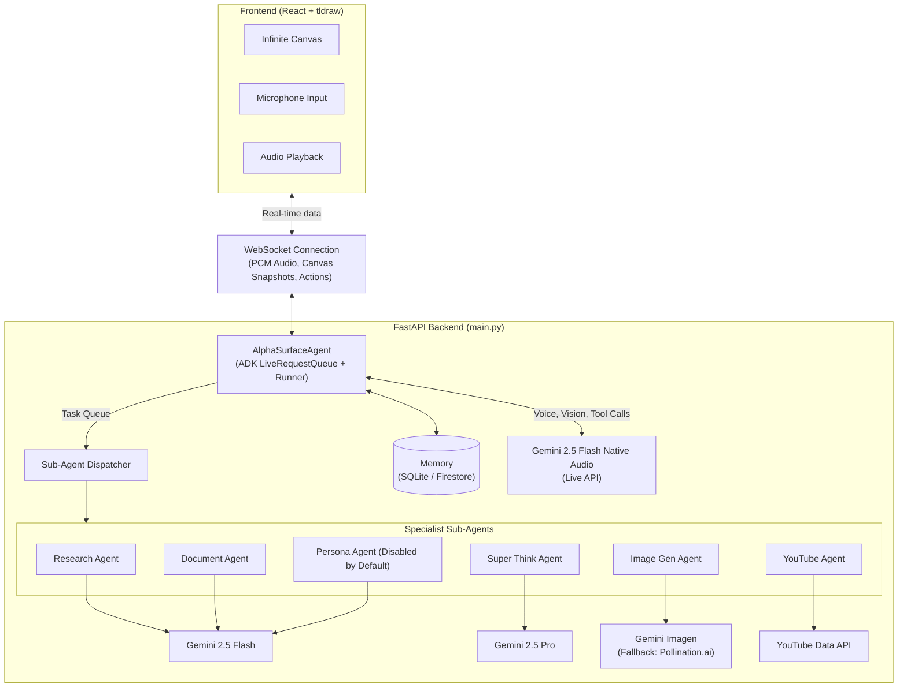

# AlphaSurface

**AI that thinks alongside you — not for you.**

AlphaSurface is a real-time voice and vision AI co-thinker built on an infinite canvas. There is no chat box, no prompt field, no "ask AI" button. The AI watches what you draw, listens to what you say, and responds spatially — placing shapes, notes, provocations, and research directly onto a shared whiteboard.

Built for the [Gemini Live Agent Challenge](https://geminiliveagentchallenge.devpost.com/) (Live Agents category).

[](https://python.org)
[](https://react.dev)
[](https://ai.google.dev)
[](https://google.github.io/adk-docs)
[](https://tldraw.dev)
[](LICENSE)

---

## Features

- **No chat box, no prompt field:** Interact by drawing and speaking — the AI responds spatially on the canvas.
- **Two session modes:**
  - **Think Mode:** For solo ideation, with AI-generated provocations to challenge your thinking.
  - **Present Mode:** For live teaching/presenting, with real-time scribing and document-grounded answers.
- **Specialist sub-agents:** Instantly trigger research, YouTube, image generation, and deep analysis tools by voice.
- **Infinite canvas:** Built on tldraw v4 for collaborative, spatial thinking.
- **Real-time voice and vision:** Powered by Gemini 2.5 Flash Native Audio and Google ADK.

---

## Quickstart (Local)

### Prerequisites

- Python 3.12+
- Node.js 18+
- [uv](https://docs.astral.sh/uv/) package manager
- A [Gemini API key](https://aistudio.google.com/apikey) (free tier works for the Live API)
- Optional: YouTube Data API v3 key (for YouTube sub-agent)

### 1. Clone the repository

```bash
git clone https://github.com/adr1en360/AlphaSurface.git
cd AlphaSurface
```

### 2. Install backend dependencies

```bash
cd backend
uv sync
```

### 3. Configure environment variables

Create `backend/.env`:

```env
# Required
GEMINI_API_KEY=your_gemini_api_key_here

# Optional — enables YouTube sub-agent
YOUTUBE_API_KEY=your_youtube_data_api_v3_key

# Optional — image generation provider (gemini | pollinations | auto)
ALPHASURFACE_IMAGE_PROVIDER=auto

# Optional — Pollinations fallback for image gen rate limits
POLLINATIONS_API_KEY=your_pollinations_key

# Optional — override model strings
ALPHASURFACE_MODEL_LIVE=gemini-2.5-flash-native-audio-preview-12-2025
ALPHASURFACE_MODEL_FAST=gemini-2.5-flash
ALPHASURFACE_MODEL_THINKING=gemini-2.5-pro

# Cloud deployment
MEMORY_BACKEND=sqlite          # sqlite (local) or firestore (cloud)
GOOGLE_GENAI_USE_VERTEXAI=false
```

### 4. Install frontend dependencies

```bash
cd ../frontend
npm install
```

---

## Running Locally

Start the backend in one terminal:

```bash
cd backend
uv run uvicorn main:app --reload --port 8000
```

Start the frontend in a second terminal:

```bash
cd frontend
npm run dev
```

Open [http://localhost:5173](http://localhost:5173) in your browser.

**Health check:**
```bash
curl http://localhost:8000/health
```

---

## Cloud Deployment (Production)

AlphaSurface is production-ready for Google Cloud Run (backend) and Vercel (frontend).

### Prerequisites

1. Install the [Google Cloud CLI (`gcloud`)](https://cloud.google.com/sdk/docs/install) and run `gcloud auth login`.
2. Create a Google Cloud Project with billing enabled.
3. Install the [Vercel CLI](https://vercel.com/docs/cli) (`npm i -g vercel`) and run `vercel login`.

### 1. Deploy the Backend to Google Cloud Run

```bash
cd backend
gcloud run deploy alphasurface-backend \
  --source . \
  --project YOUR_PROJECT_ID \
  --region us-central1 \
  --allow-unauthenticated \
  --set-env-vars GEMINI_API_KEY="YOUR_GEMINI_API_KEY",MEMORY_BACKEND="firestore",GOOGLE_CLOUD_PROJECT="YOUR_PROJECT_ID" \
  --memory 1Gi \
  --port 8000
```
*After deploy, copy the Service URL (e.g., `https://alphasurface-backend-xxxxxx-uc.a.run.app`).*

### 2. Configure and Deploy the Frontend to Vercel

1. Edit `frontend/vite.config.js`:
   - Change the proxy target to your Cloud Run backend URL.
   - Add `changeOrigin: true` to the proxy config.
2. Deploy:

```bash
cd ../frontend
vercel --prod
```
*Vercel will provide a live URL after deploy.*

---


## Architecture



---

## Tech Stack

| Layer | Technology |
|---|---|
| Frontend | React 19, Vite, tldraw v4, Framer Motion |
| Backend | Python 3.12, FastAPI, WebSockets, uv |
| AI — Live voice | Gemini 2.5 Flash Native Audio (`gemini-2.5-flash-native-audio-preview-12-2025`) |
| AI — Sub-agents | Gemini 2.5 Flash via Google ADK |
| AI — Deep analysis | Gemini 2.5 Pro with extended thinking budget |
| AI — Image generation | Gemini Imagen / Pollinations fallback |
| Agent framework | Google Agent Development Kit (ADK) |
| Memory | SQLite (local), Firestore (Cloud Run) |
| Cloud | Google Cloud Run |

---

## Prerequisites

- Python 3.12+
- Node.js 18+
- [uv](https://docs.astral.sh/uv/) package manager
- A [Gemini API key](https://aistudio.google.com/apikey) (free tier works for the Live API)
- Optional: YouTube Data API v3 key (for YouTube sub-agent)

---

## Local Setup

### 1. Clone the repository

```bash
git clone https://github.com/adr1en360/AlphaSurface.git
cd AlphaSurface
```

### 2. Install backend dependencies

```bash
cd backend
uv sync
```

### 3. Configure environment variables

Create `backend/.env`:

```env
# Required
GEMINI_API_KEY=your_gemini_api_key_here

# Optional — enables YouTube sub-agent
YOUTUBE_API_KEY=your_youtube_data_api_v3_key

# Optional — image generation provider (gemini | pollinations | auto)
ALPHASURFACE_IMAGE_PROVIDER=auto

# Optional — Pollinations fallback for image gen rate limits
POLLINATIONS_API_KEY=your_pollinations_key

# Optional — override model strings
ALPHASURFACE_MODEL_LIVE=gemini-2.5-flash-native-audio-preview-12-2025
ALPHASURFACE_MODEL_FAST=gemini-2.5-flash
ALPHASURFACE_MODEL_THINKING=gemini-2.5-pro

# Cloud deployment
MEMORY_BACKEND=sqlite          # sqlite (local) or firestore (cloud)
GOOGLE_GENAI_USE_VERTEXAI=false
```

### 4. Install frontend dependencies

```bash
cd ../frontend
npm install
```

---

## Running Locally

Start the backend in one terminal:

```bash
cd backend
uv run uvicorn main:app --reload --port 8000
```

Start the frontend in a second terminal:

```bash
cd frontend
npm run dev
```

Open [http://localhost:5173](http://localhost:5173) in your browser.

**Health check:**
```bash
curl http://localhost:8000/health
```

---


## Usage & Onboarding

On first launch, you’ll see the onboarding flow:

1. **Choose a mode:** Think Mode (solo) or Present Mode (live presentation)
2. **Describe your session focus:** (optional, helps the AI orient)
3. **Upload reference material:** PDFs or Docx files (Present Mode only)

Config is saved to `localStorage` so you skip onboarding on subsequent visits. To reset:

```js
localStorage.removeItem("alpha_surface_config")
```

### Think Mode

- Talk freely about your ideas while drawing on the canvas
- Go quiet for ~8 seconds — a violet provocation note will appear
- Say "research X", "find a video on Y", or "generate an image of Z" to trigger sub-agents
- Say "super think" or "deep dive" for a full Gemini 2.5 Pro analysis
- Say "organize this" to align and distribute shapes

### Present Mode

- Pre-load a document via onboarding or the main menu
- Present — the AI scribes dates, concepts, and key points onto the canvas
- Ask "what does the document say about X?" for grounded answers
- The AI stays silent unless spoken to

### Controls

The status pill (top-center) shows AI state and has two toggles:

| Toggle | Function |
|---|---|
| 🎤 MIC ON/OFF | Mute/unmute your microphone (AI stops receiving audio) |
| 🔊 SPEAKER ON/OFF | Mute/unmute AI voice output (you still send audio) |


The tldraw hamburger menu (top-left) contains:

- **Save canvas** — exports canvas state as `.tldr` file
- **Load canvas** — imports a saved `.tldr` file
- **Export PDF** — renders all pages to a multi-page PDF
- **Upload document** — adds a document for the agent to reference

---

## 🧪 Reproducible Testing (For Judges)

To verify the core functionalities of AlphaSurface, please follow these testing steps once the app is running (either locally or via the provided deployed URL).

**Test 1: Core Voice & Spatial Canvas (Think Mode)**
1. Launch the app and select **Think Mode** in the onboarding modal.
2. Unmute your microphone using the top-center Status Pill.
3. **Action:** Draw a simple flowchart or write a few words on the canvas.
4. **Speak:** *"I'm drawing out a new system architecture, what do you think I should add?"*
5. **Expected Result:** The Gemini Live agent will reply verbally, understanding the spatial context of what you just drew, and may place a violet "provocation" note on the canvas.

**Test 2: Sub-Agent Dispatch (YouTube & Research)**
1. While still in Think Mode, test the tool-calling dispatch system.
2. **Speak:** *"Can you find a YouTube video explaining the Gemini Live API?"*
3. **Expected Result:** The Live Orchestrator will pause, dispatch the `YouTube Agent`, and embed a playable YouTube video directly onto your canvas.
4. **Speak:** *"Generate an image of a futuristic robot working on a whiteboard."*
5. **Expected Result:** The `Image Gen Agent` will generate and place an image on the canvas (demonstrating the Gemini Imagen/Pollinations fallback logic).

**Test 3: Document Grounding (Present Mode)**
1. Refresh the page or use the top-left hamburger menu to clear the config and select **Present Mode**.
2. Upload a sample PDF or DOCX file when prompted.
3. **Speak:** *"What are the three main takeaways from this document?"*
4. **Expected Result:** The AI will analyze the document and physically scribe the key points onto the canvas as text blocks.

---

## Project Structure

```
AlphaSurface/
├── backend/
│   ├── main.py                 # FastAPI server + WebSocket handler
│   ├── live_session.py         # Gemini Live API session management
│   ├── agent.py                # ADK LlmAgent factory
│   ├── agent_tasks.py          # Task queue + scratch pad
│   ├── dispatcher.py           # Routes tasks to sub-agents
│   ├── event_bus.py            # Idle detection + provocation cooldowns
│   ├── memory.py               # SQLite / Firestore dual backend
│   ├── model_config.py         # Model string constants
│   ├── prompts/
│   │   ├── base.txt            # Core agent personality
│   │   ├── think_mode.txt      # Think Mode addendum
│   │   ├── present_mode.txt    # Present Mode addendum
│   │   └── loader.py           # Prompt builder
│   ├── tools/
│   │   ├── basic_write.py      # add_note, add_geo, zoom_to_fit, memory...
│   │   ├── smart_write.py      # place_near, place_in_empty_space
│   │   ├── organize.py         # align, distribute, stack, rotate...
│   │   ├── spatial_read.py     # get_viewport_context, get_canvas_map...
│   │   ├── semantic.py         # label_shape, get_semantic_graph
│   │   ├── pen_draw.py         # draw_freehand
│   │   ├── dispatch.py         # dispatch_research, dispatch_youtube...
│   │   └── state.py            # Shared canvas state
│   └── sub_agents/
│       ├── research_agent.py
│       ├── image_gen_agent.py
│       ├── youtube_agent.py
│       ├── document_agent.py
│       ├── super_think_agent.py
│       ├── continuation_agent.py
│       └── persona_agent.py
├── frontend/
│   ├── src/
│   │   ├── App.jsx
│   │   ├── agent/AlphaSurfaceInner.jsx  # WS, mic, canvas capture, status
│   │   ├── audio/AudioPlayback.js       # PCM audio playback singleton
│   │   ├── canvas/
│   │   │   ├── canvasActions.js         # All tldraw shape operations
│   │   │   ├── canvasSnapshot.js        # Three-tier spatial context builder
│   │   │   └── shapeConverters.js       # BlurryShape / FocusedShape / Clusters
│   │   └── components/
│   │       ├── OnboardingFlow.jsx
│   │       ├── StatusPill.jsx
│   │       └── AlphaMainMenu.jsx
│   └── vite.config.js
└── README.md
```

---

## Environment Variables Reference

| Variable | Default | Description |
|---|---|---|
| `GEMINI_API_KEY` | — | **Required.** AI Studio API key. |
| `YOUTUBE_API_KEY` | — | YouTube Data API v3. Required for YouTube sub-agent. |
| `ALPHASURFACE_MODEL_LIVE` | `gemini-2.5-flash-native-audio-preview-12-2025` | Live voice model. |
| `ALPHASURFACE_MODEL_FAST` | `gemini-2.5-flash` | Sub-agent model. |
| `ALPHASURFACE_MODEL_THINKING` | `gemini-2.5-pro` | SuperThink deep analysis model. |
| `ALPHASURFACE_MODEL_IMAGE` | `gemini-2.5-flash-image` | Image generation model. |
| `ALPHASURFACE_IMAGE_PROVIDER` | `auto` | `gemini`, `pollinations`, or `auto` (Gemini with Pollinations fallback on 429). |
| `POLLINATIONS_API_KEY` | — | Pollinations API key for image fallback. |
| `ALPHASURFACE_BASE_URL` | `http://localhost:8000` | Base URL for serving static images. Override for Cloud Run. |
| `MEMORY_BACKEND` | `sqlite` | `sqlite` (local) or `firestore` (Cloud Run). |
| `MEMORY_DB_PATH` | `backend/alphasurface_memory.db` | SQLite file path override. |
| `GOOGLE_GENAI_USE_VERTEXAI` | `false` | Set `true` to use Vertex AI instead of AI Studio. |
| `GOOGLE_CLOUD_PROJECT` | — | Required if using Vertex AI. |

---

## Cloud Deployment (Google Cloud Run)

### Prerequisites

- [Google Cloud CLI](https://cloud.google.com/sdk/docs/install) installed and authenticated
- A GCP project with billing enabled
- Cloud Run, Artifact Registry, and Firestore APIs enabled

### Deploy

```bash
# Build and push container
gcloud builds submit --tag gcr.io/YOUR_PROJECT_ID/alphasurface-backend ./backend

# Deploy to Cloud Run
gcloud run deploy alphasurface-backend \
  --image gcr.io/YOUR_PROJECT_ID/alphasurface-backend \
  --platform managed \
  --region us-central1 \
  --allow-unauthenticated \
  --set-env-vars GEMINI_API_KEY=your_key,MEMORY_BACKEND=firestore,GOOGLE_CLOUD_PROJECT=YOUR_PROJECT_ID \
  --memory 1Gi \
  --port 8000
```

### Frontend

Update `frontend/vite.config.js` to proxy to your Cloud Run URL, then deploy the frontend to Firebase Hosting, Cloud Run, or any static host.

---

## Development

### Backend tests

```bash
cd backend
uv run pytest
```

### Frontend lint

```bash
cd frontend
npm run lint
```

### Adding a new tool

1. Implement the function in the relevant `tools/` file
2. Import it in `tools/__init__.py` and add it to `ALL_TOOLS`
3. Add a docstring — the agent uses it to decide when to call the tool
4. Restart the backend

### Adding a new sub-agent

1. Create `sub_agents/your_agent.py` with an `async def run(payload, broadcast_fn)` handler
2. Register it in `main.py` lifespan with `register_handler("your_agent", handler)`
3. Add a `dispatch_your_agent(...)` function in `tools/dispatch.py`
4. Import and expose it in `tools/__init__.py`

---

## Key Design Decisions

**No text channel.** All AI output is spatial — shapes, notes, arrows, embeds. There is no chat panel and no text fallback. This is intentional and is the core differentiator.

**Sarkar provocations.** Based on Advait Sarkar's research on AI as a thinking partner. The AI challenges and supports human thinking rather than replacing it. Provocations are always open questions, never answers or statements.

**Three-tier canvas context.** The frontend sends a structured spatial snapshot every 3 seconds: focused shapes (selected/agent-placed, full detail), blurry shapes (viewport overview), and peripheral clusters (off-screen shapes grouped by proximity). This gives Gemini spatial awareness without flooding its context window.

**Orchestrator + continuation pattern.** The Live Agent handles real-time voice and quick canvas actions. Complex multi-step tasks are deferred to the ContinuationAgent so the live voice session stays responsive.

---

## Known Limitations

- Gemini Live API sessions have a 12-minute hard limit; AlphaSurface auto-reconnects
- YouTube sub-agent requires a YouTube Data API v3 key with the API enabled in your GCP project
- Image generation falls back to Pollinations when Gemini Imagen quota is exhausted
- PersonaAgent is disabled by default to reduce API calls during development

---

## Contributing

1. Fork the repository and create a branch
2. Keep pull requests focused on one feature or fix
3. Test both Think Mode and Present Mode before opening a PR
4. Include a summary of what changed and why

---

## License

MIT — see [LICENSE](LICENSE) for details.

---


## Acknowledgements

- [Advait Sarkar](https://advait.org) — research on AI as a thinking partner, not a replacement ([YouTube talk](https://youtu.be/3lPnN8omdPA?si=u42NSZIWLtgHaBsT))
- [tldraw](https://tldraw.dev) — infinite canvas foundation
- [Google ADK](https://google.github.io/adk-docs) — agent orchestration
- [Gemini Live API](https://ai.google.dev/gemini-api/docs/live) — real-time voice and vision

---

*Built for the Gemini Live Agent Challenge 2026 · [Devpost](https://geminiliveagentchallenge.devpost.com)*